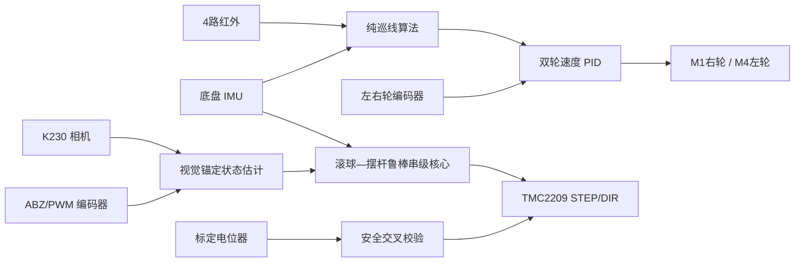

# H题系统集成、标定与验收

## 1. 赛题约束映射

| 赛题项目 | 软件实现 | 实车验收门槛 |
|---|---|---|
| 红外自主巡线一圈 | MSPM0 四路加权质心、IMU 偏航阻尼、左右轮编码器速度闭环 | 约 6.14 m，一圈不超过 20 s |
| A 点横线停车 | 离开起点确认、4.50 m 里程消隐、横线连续确认、可标定前移距离 | 停车基准偏差不超过 2 cm |
| 静态 `O→+5 cm→-5 cm` | STM32 `App_Identification_Start()` 自动序列与计时 | 总时间不超过 5 s，最终误差不超过 1 cm |
| A 到 B | MSPM0 自主差速底盘；STM32 保持目标位置 | 不超过 8 s，球误差不超过 1 cm |
| 动态一圈 | 底盘自主巡线，STM32 视觉闭环独立保持中心/指定点 | 不超过 30 s，球误差不超过 1 cm |
| 球位置必须由相机测量 | K230 发送位置、速度、置信度、帧龄；STM32 只在视觉锁定后允许启动 | 遮挡/超时 200 ms 内停 STEP 并锁存故障 |

## 2. 架构和控制权



- MSPM0 仅开放 M1/A 与 M4/D，分别为右、左驱动轮；B/C 永久不参与运动输出。
- 巡线算法只产生 `m/s` 左右轮目标，唯一的 5 ms 控制任务完成 RPM 换算、
  编码器反馈、PID 和 PWM。普通停止由控制任务消费，急停才允许跨任务抢占。
- STM32 的 `ball_control_core` 不引用 HAL/BSP，输入为位置、速度、摆杆角度和
  底盘加速度，输出为目标角和有符号步频。执行适配只在 `app_controller.c`。
- 目标位置所有者优先级为比赛序列 > 阶跃辨识 > 操作员。低优先级请求不能覆盖
  正在运行的高优先级序列；急停无条件清零并释放所有者。
- K230 视觉是球位置的绝对锚点；磁编码器和电位器测量摆杆，不被错误地当成球位置。
  SDM18 只有完成“距离到球轴位置”的独立几何标定后才允许融合。

## 3. 算法入口与档位

MSPM0 纯算法入口：

```c
app_line_follower_init(&ctx, NULL);
app_line_follower_set_profile(&ctx, APP_LINE_PROFILE_SAFE);
app_line_follower_step(&ctx, &input, &output);
```

`SAFE / PRECISION / BALANCED / FAST` 四档均包含误差滤波、曲率降速、横向加速度
上限、偏航角速度上限、逐轮加速度/加加速度（S 曲线）约束、丢线搜索和 IMU 偏航
阻尼。规划使用目标差速与实测 yaw rate 中较大的转弯强度计算速度上限，可在实际
车体旋转超过指令时主动减速，降低滚球平衡外环需要吸收的底盘冲击。量产默认档由
`PRJ_LINE_TRACK_DEFAULT_PROFILE` 选择；自定义参数必须通过整体校验接口提交，不能
逐字段热改造成半新半旧的控制瞬态。

IMU 安装补偿的纯算法入口为 `app_imu_kinematics_step()`。原始加速度和角速度先乘
`PRJ_IMU_R_BS_*` 安装矩阵转到车体系，再减去车体系零偏。刚体上各点的角速度相同，
所以“陀螺仪不在中轴线”不会改变 yaw rate，本工程不会对角速度做错误的平移补偿；
偏心影响的是加速度，按下式把 IMU 测点还原到底盘旋转中心：

`a_center = a_imu - α×r - ω×(ω×r)`，其中 `r=(OFFSET_X, OFFSET_Y, OFFSET_Z)`
为旋转中心指向 IMU 的杆臂。平面 yaw 下，代码等价加入
`Δax=αz·ry+ωz²·rx`、`Δay=-αz·rx+ωz²·ry`。补偿后的纵向加速度通过现有底盘—STM32
协议送入平衡前馈，接口和通信帧无需变化。

STM32 纯算法入口：

```c
BallCtrlCore_Init(&ctx, NULL);
BallCtrlCore_SetProfile(&ctx, BALL_CTRL_PROFILE_PRECISION);
BallCtrlCore_SetTarget(&ctx, 50.0f);
BallCtrlCore_StepOuter(&ctx, &outer_input);
BallCtrlCore_StepInner(&ctx, &inner_input);
```

外环含限速度、限加速度、限加加速度参考轨迹，实心球近似模型
`theta_ff = 7/5 * acceleration / g`，位置—速度反馈、积分抗饱和和连续边界层
鲁棒补偿；内环为角度—角速度串级与步频限幅。默认档由
`USER_DEFAULT_BALL_PROFILE` 选择。`USER_START_ACTION` 选择按键启动动态中心保持，
或直接运行 `+5 cm/-5 cm` 静态阶跃验收。

## 4. 三端接线与协议

| 链路 | 发送端 | 接收端 | 参数 |
|---|---|---|---|
| 底盘—平衡主控 | MSPM0 UART1 PB6(TX)/PB7(RX) | STM32 USART2 PD6(RX)/PD5(TX) | 115200, 8N1, 交叉连接，共地 |
| 视觉—平衡主控 | K230 UART TX/RX | STM32 USART3 PD9(RX)/PD8(TX) | 921600, 8N1, 3.3 V TTL，共地 |
| SDM18 | 传感器 UART | STM32 UART4 PC11(RX)/PC10(TX) | 921600, 8N1 |

通用帧为小端序：`A5 5A | version:u8 | id:u8 | length:u16 | seq:u16 |
timestamp_us:u32 | payload | CRC16-CCITT-FALSE:u16`；CRC 覆盖 `version` 到
`payload`。底盘消息为 `0x10` 命令、`0x11` 状态、`0x12` IMU、`0x13` 心跳；
视觉为 `0x20` 位姿、`0x21` 状态、`0x22` 目标。

MSPM0 UART0 仅调试文本，UART1 仅二进制；严禁把 `printf` 重定向到 UART1。
克隆仓库中的 Board B/旧 COBS 代码作为可选参考保留，但当前比赛拓扑不初始化它，
避免与 STM32 专用链路争用 UART1。

## 5. 必做标定

1. 架空车轮，确认正命令时 M1/A 右轮、M4/D 左轮都使车体向前；任一反向只改
   电机方向配置，不交换算法左右定义。
2. 测量轮径、编码器电机轴每转脉冲和减速比，更新 `PRJ_CF_WHEEL_RADIUS_M` 与
   `PRJ_ENCODER_PULSES_PER_REV`。让车直行 2 m，分别校正左右轮比例。
3. 按左到右确认红外 `LINE_TRACK_CH_MAP`。黑线时 BSP 输出必须为 1；白底为 0。
   从 `SAFE` 档开始逐步增速，先调 `kp`，再用很小的 `kd` 抑制摆动。
4. STM32 上电软件零点用于台架调试；正式机械零点用 ABZ 的 Z 边沿复核。
   实测一整转计数后同时更新估计器、控制器的 `mrad_per_count`。
5. 电位器在机械最小/最大角分别记录 ADC，调用 `BSP_Adc_SetCalibration()`；未标定时
   安全模块明确禁止拿 ADC 原始值与编码器 mrad 比较。
6. K230 在球道两端至少取两个像素—毫米点，构造 `BallPositionTracker`。推荐增加
   中心和 ±5 cm 点验证线性残差；误差超过 2 mm 时改用分段标定，不能靠控制积分掩盖。
7. 测量 STEP 正方向是否使球朝正坐标加速；符号不一致只反转 DIR 定义。先用
   `SAFE`，确认内环稳定后再闭合位置外环。
8. 以左右轮接地点中点为底盘旋转中心，沿车体 `+X` 前、`+Y` 左、`+Z` 上测量 IMU
   坐标并填写 `PRJ_IMU_OFFSET_*_M`。例如 IMU 位于中轴线右侧 35 mm，则
   `OFFSET_Y_M=-0.035f`；不要用 PCB 几何中心替代传感芯片位置。
9. 用已知车体姿态核对传感器三轴方向，填写 `PRJ_IMU_R_BS_*`。该矩阵必须是右手、
   近似正交的旋转矩阵；静止采集零偏填入 `PRJ_IMU_GYRO_BIAS_*_DPS`。原地匀速旋转时
   补偿后中心横纵加速度应接近零；正反向角加速时残差应符号相反且幅值相近。
10. 做前后加速检查补偿后 `accel_x_g` 符号和时间戳。STM32 前馈增益从 0 开始，只有
    符号、延迟和比例确认后开启；若 yaw 微分噪声大，先减小
    `PRJ_IMU_YAW_ACCEL_ALPHA`，不可用加大平衡积分来掩盖。
11. 从 `SAFE` 档记录速度、加速度、加加速度、目标/实测 yaw rate 和球最大偏差。
    先提高横向加速度上限，再提高最高速度，最后才提高 jerk；任何一步若球偏差或
    步进饱和明显增大则退回上一档。急停、过流和丢线超时始终绕过平滑器立即停止。

## 6. 软件验收

在仓库根目录执行：

```powershell
python k230\tests\test_ball_balance_link.py
powershell -File mspm0\MSPM0G3507_Project\MSPM0G3507_FreeRTOS\Test\run_line_follower_host.ps1
powershell -File mspm0\MSPM0G3507_Project\MSPM0G3507_FreeRTOS\Test\check_arm_syntax.ps1
powershell -File stm32f4\balance_control\Tools\run_ball_control_tests.ps1
powershell -File stm32f4\balance_control\Tools\check_ioc.ps1
powershell -File stm32f4\balance_control\Tools\check_user_layout.ps1
powershell -File stm32f4\balance_control\Tools\check_arm_syntax.ps1
git diff --check -- . ':(exclude)mspm0'
```

应得到 K230、循迹、IMU 刚体补偿和 STM32 平衡算法测试 `PASS`，IOC/目录/ARM
语法检查 `passed` 且无空白错误。
`mspm0` 是保留上游 SDK 历史格式的源码快照，第三方 CMSIS/TI 文件存在上游行尾
空格，因此根级空白检查明确排除整个快照；本项目修改过的 MSPM0 文件在导入前已
相对上游单独通过 `git diff --check`。
Keil 或 TI 工具链可用时还必须执行完整链接，检查 Flash/RAM、重复回调和未解析符号。

## 7. 实车分级验收

1. **断电检查**：尺寸、重心、球道机械限位、常闭限位回路、3.3 V 电平和共地。
2. **急停检查**：拔开任一常闭限位、触发 DIAG、遮挡相机超过 200 ms，STEP 应在
   一个控制周期内停止并拉高 ENN；故障未解除不能清除。
3. **底盘低速**：`SAFE` 档完成 3 圈，无丢线、方向反转或编码器符号错误；记录左右
   RPM、红外状态、yaw rate、规划加速度/jerk 和最大控制周期。分别把 IMU 临时安装
   在中轴线左右已知距离，填写正确杆臂后，原地转向的中心加速度残差不应随安装侧
   改变符号或显著改变幅值。
4. **单圈停车**：标定 `LINE_TRACK_FINISH_ADVANCE_M`，至少 10 次测量 A 点偏差；
   取最差值而非平均值，必须不超过 2 cm。
5. **静态滚球**：将 `USER_START_ACTION` 设为静态阶跃，至少 10 次运行。读取
   `App_Identification_GetResult()`；总时长 ≤5 s、两个目标最终误差均 ≤1 cm。
6. **动态中心**：恢复动态启动，先直线慢速，再半圆，再整圈；按
   `SAFE→BALANCED→FAST` 递进。任何档位只有在最差球误差 ≤1 cm、调度无丢 tick、
   步频/角度无长期饱和时才允许升级。
7. **扰动与降级**：改变电池电压、球初始偏差、光照、底盘加速度；注入坏 CRC、
   丢帧、相机短时遮挡和 IMU 超时。陈旧前馈应平滑归零，视觉超过预测窗应停机。

验收记录至少保存固件提交号、参数档、机械标定值、每次时长、最大误差、最大循环
时间、调度积压/丢 tick、协议 CRC/序号错误和故障位。没有实车记录时只能判定
“软件链路验收通过”，不能宣称赛题指标已经通过。
